# AI Lawyer — Immigration & International Tax Assistant

An AI legal assistant with two practice areas, covering the **UK**, the **United States**, the
**European Union** and **Spain**:

- **Immigration & visas** — describe your situation and get a structured case profile with
  candidate visa routes and a document checklist.
- **Tax & corporate structuring** — describe your business and get a proposed group of
  entities with an ownership diagram, a risk register, the filings it triggers, and costs.

Both share the same streaming chat, adviser matching and booking flow; you pick one with a
switcher on the home screen.

Built as a universal **Expo (React Native)** app — one codebase running on iOS, Android and the
web — backed by a **Python FastAPI** service, with a separate **React admin portal**.
English and Spanish throughout.

UI adapted from [AI Lawyer Matching App UI](https://dribbble.com/shots/27558038-AI-Lawyer-Matching-App-UI)
by [Tonmoy Das](https://dribbble.com/luminar-workshop).

---

## Product walkthrough

### 1 · Getting in

Onboarding, then sign-in. A legal disclaimer is acknowledged once before the assistant is
reachable, and the language toggle sits on the first screen.

| Onboarding | Sign in | Spanish (español) |
|---|---|---|
| 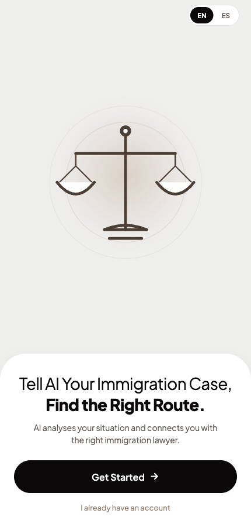 | 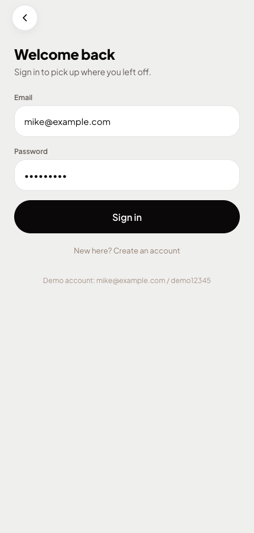 | 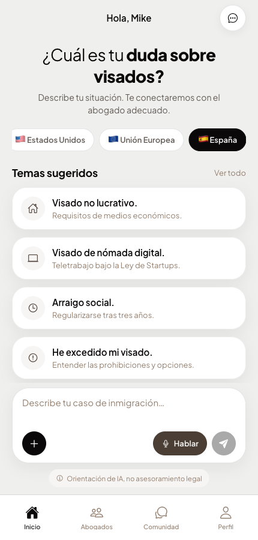 |

### 2 · Immigration

Pick a jurisdiction, describe the situation or tap a suggested topic, and the AI returns a
structured case profile: candidate routes with fit scores, timelines and costs, plus a
document checklist you can tick off.

| Home — case intake | Case analysis | Lawyer directory |
|---|---|---|
| 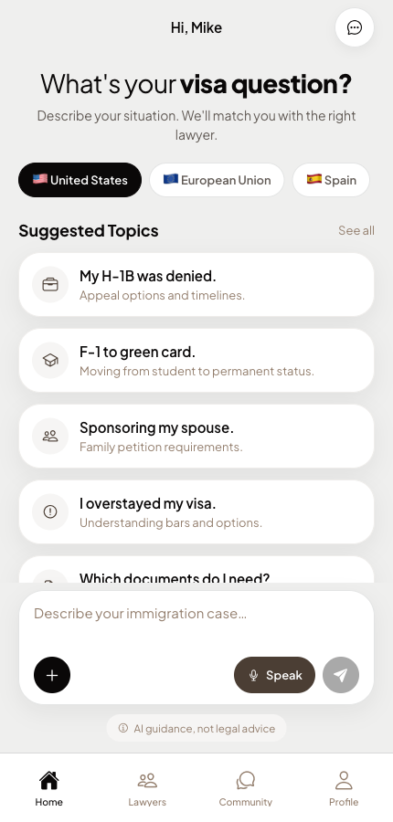 | 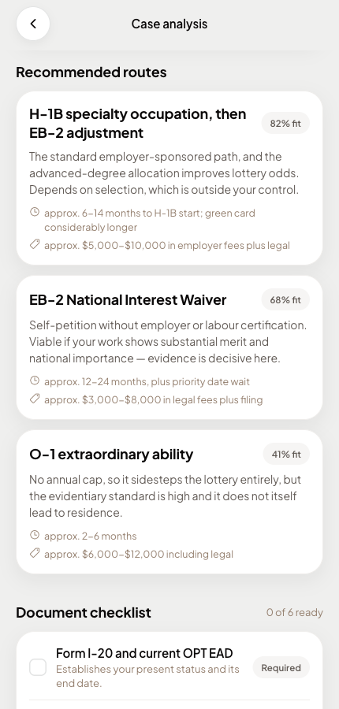 | 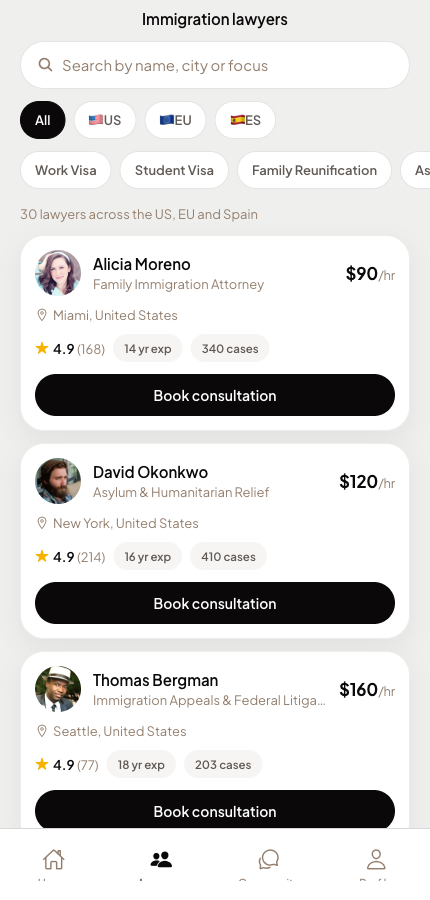 |

| Lawyer profile & booking | Community forum | Discussion thread |
|---|---|---|
| 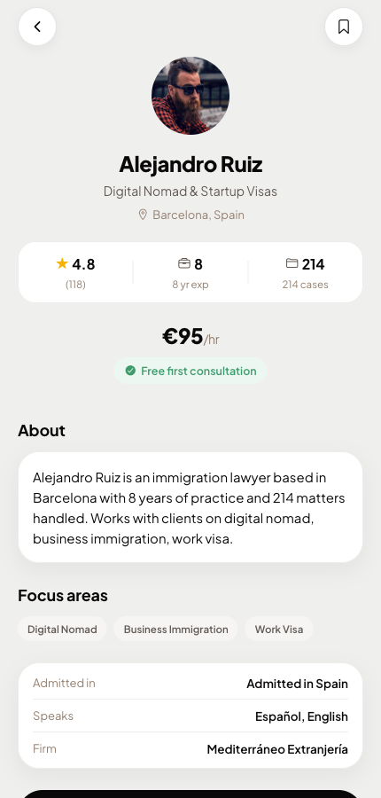 | 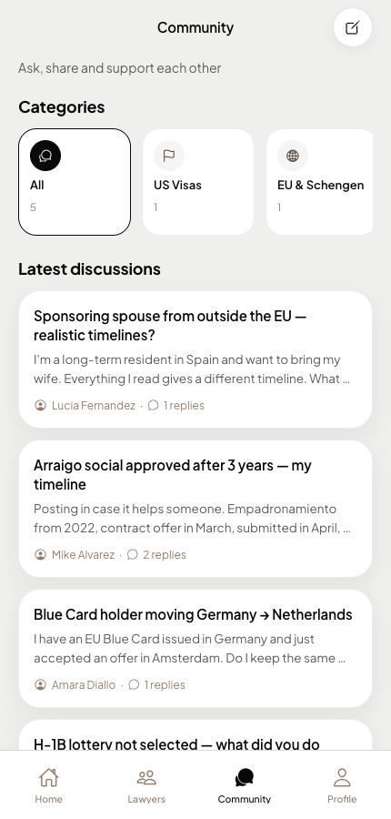 | 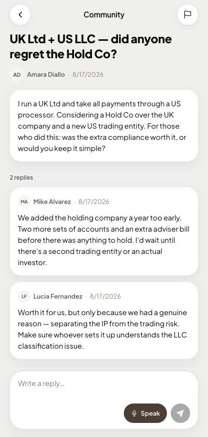 |

### 3 · Tax & corporate structuring

The second practice area. Same chat surface, different reasoning: the output is a **group of
entities** with an ownership diagram, a severity-rated risk register, and the filings the
structure would create.

| Tax home | Streaming answer | Proposed group |
|---|---|---|
| 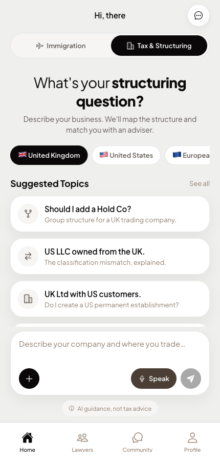 | 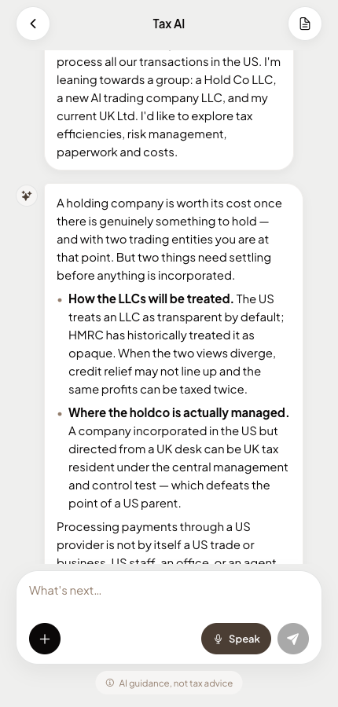 | 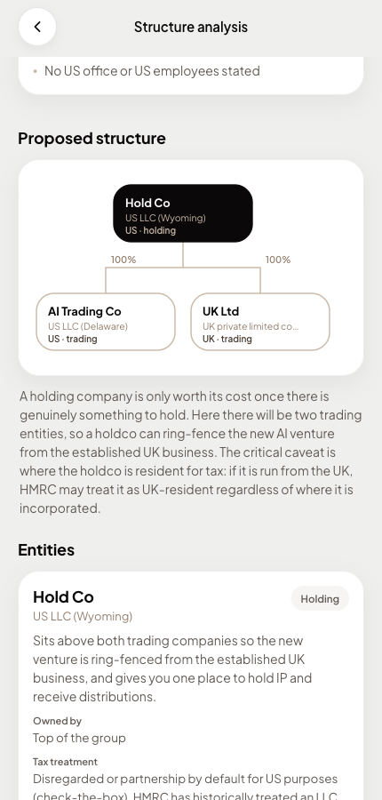 |

| Risk register | Filing obligations | Tax adviser directory |
|---|---|---|
| 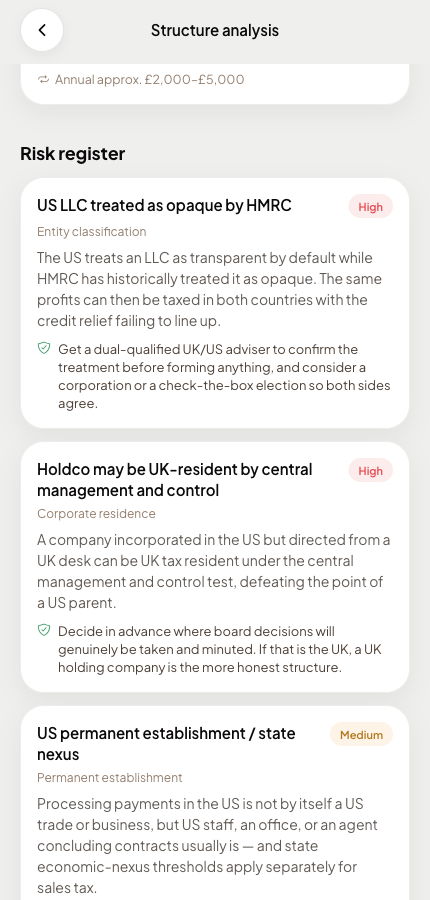 | 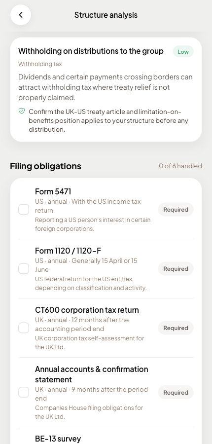 | 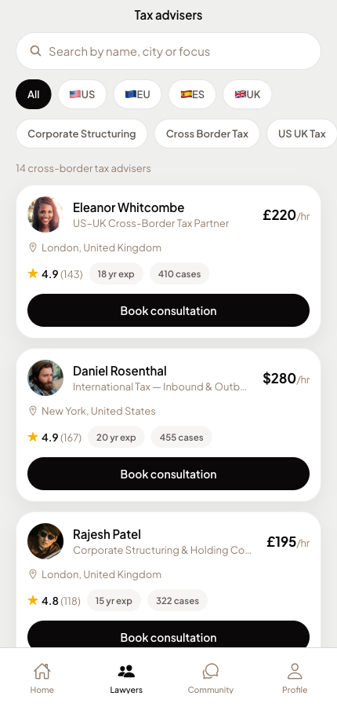 |

### 4 · Running natively

The same codebase on an iPhone through Expo Go — no web wrapper.

| iOS Simulator |
|---|
| 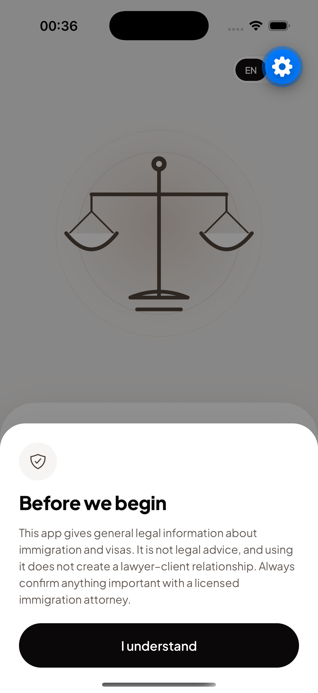 |

### 5 · Admin portal

Lawyers, advisers and the home-screen topics are editable in both languages without a deploy.

| Dashboard | Adviser management | Suggested topics (EN/ES) |
|---|---|---|
| 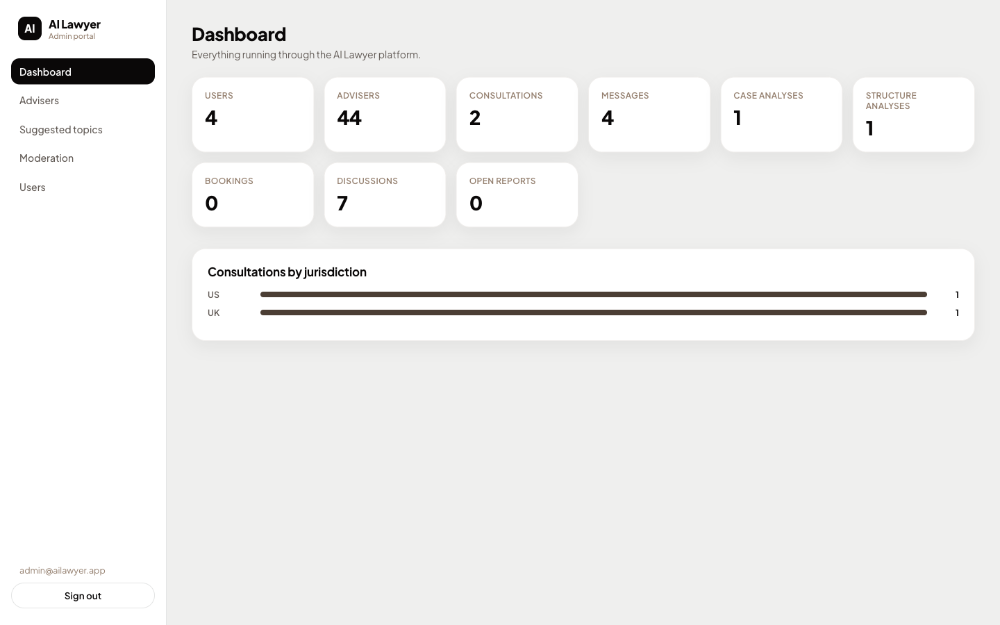 | 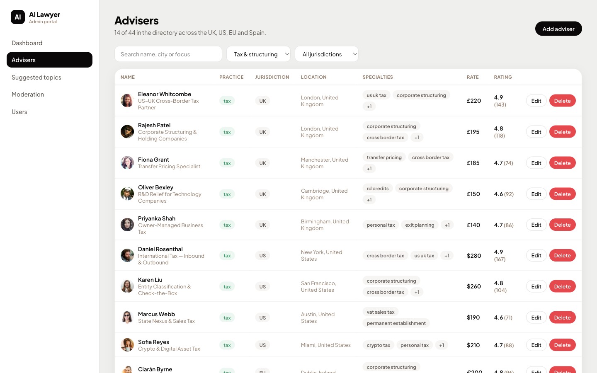 | 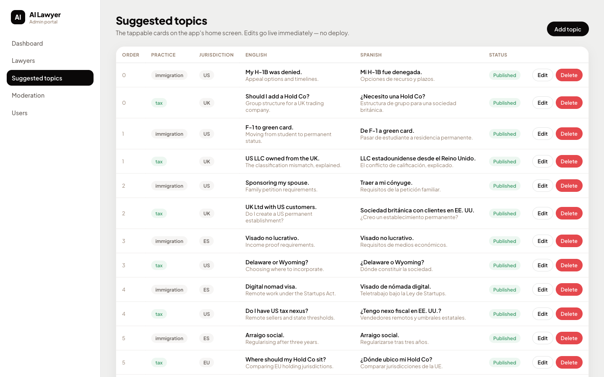 |

> The two analysis screens and the chat transcript above are shown with the worked examples
> from `backend/app/demo_data.py` — hand-written, not model output — so the screens can be
> explored without an API key. Live output requires `OPENAI_API_KEY`; the "AI is not
> configured" banner in the app is what you see until you set one.

---

## Features

**AI legal assistant** — streaming chat grounded in a jurisdiction-specific system prompt
(USCIS/DoS for the US, the EU directives and national authorities for the EU, the Reglamento de
Extranjería and Ley de Startups for Spain). Hard guardrails: never claims to be a lawyer, never
invents statute numbers, form numbers, fees or processing times, and escalates deadlines,
removal proceedings and unlawful-presence bars to a licensed attorney.

**Case triage** — the free-text description is parsed with OpenAI Structured Outputs into a
typed profile: nationality, current status, target jurisdiction, urgency, key facts, up to
three candidate visa routes with fit scores and timelines, a required-documents checklist, and
red flags.

**Lawyer matching** — deterministic Python scoring against the triage profile (jurisdiction,
specialty overlap, language, rating, experience). No second model call, so results are fast,
free and explainable — every match ships the reasons that produced it.

**Directory & booking** — 44 seeded advisers (30 immigration lawyers, 14 cross-border tax
advisers) across the UK, US, EU and Spain, filterable by practice, jurisdiction, specialty and
language. Booking opens WhatsApp or email prefilled with the case summary; nothing is sent on
the user's behalf.

**Peer support forum** — categorised discussions (US visas, EU/Schengen, Spain, asylum, work
permits, family reunification, company structuring, cross-border tax) with AI pre-screening and
a user report flow.

**Admin portal** — lawyer CRUD, editable home-screen topics in both languages, a moderation
queue, user roles, and usage stats.

**Tax & corporate structuring** — a second practice area for founders and directors with
cross-border businesses. The AI is grounded in a jurisdiction-specific brief (HMRC and
corporate residence by central management and control for the UK; check-the-box classification,
Forms 5471/1120-F and state nexus for the US; ATAD and DAC6 for the EU; the ETVE regime and
modelo 232 for Spain).

Its structured output is a **group**, not a ranked list: each entity with its jurisdiction,
legal form, owner, rationale, likely tax treatment and cost — rendered as an ownership diagram
— plus a severity-rated risk register (entity classification, corporate residence, permanent
establishment, transfer pricing, withholding), a checkable list of the filings the structure
triggers, setup and annual cost estimates, and the alternatives it set aside.

**Bilingual** — full EN/ES interface, and the AI answers in the user's language.

---

## Architecture

```
AILawyer/
├── backend/     FastAPI · SQLAlchemy · SQLite · OpenAI Responses API
├── mobile/      Expo Router universal app (iOS · Android · web)
├── admin/       Vite + React admin dashboard
└── docs/        screenshots
```

### System

Three clients, one API. The OpenAI key lives only in `backend/.env` and is never shipped to a
client — the app talks to the backend, and only the backend talks to OpenAI.

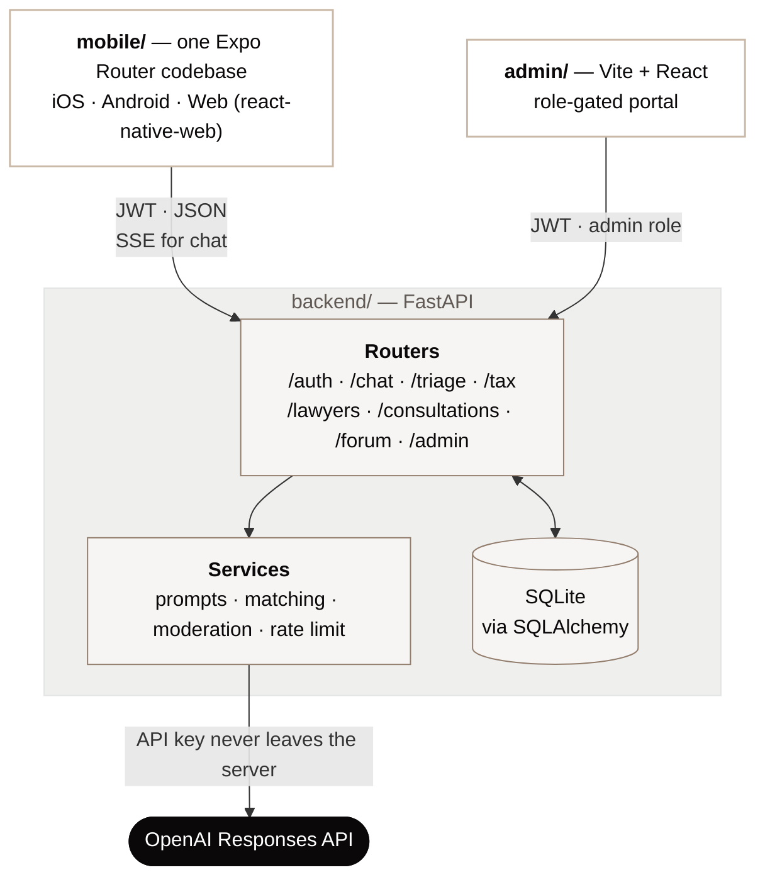

### Request flow

Chat streams token-by-token over SSE. The analysis step is a separate, non-streaming call that
returns a schema-valid object rather than prose.

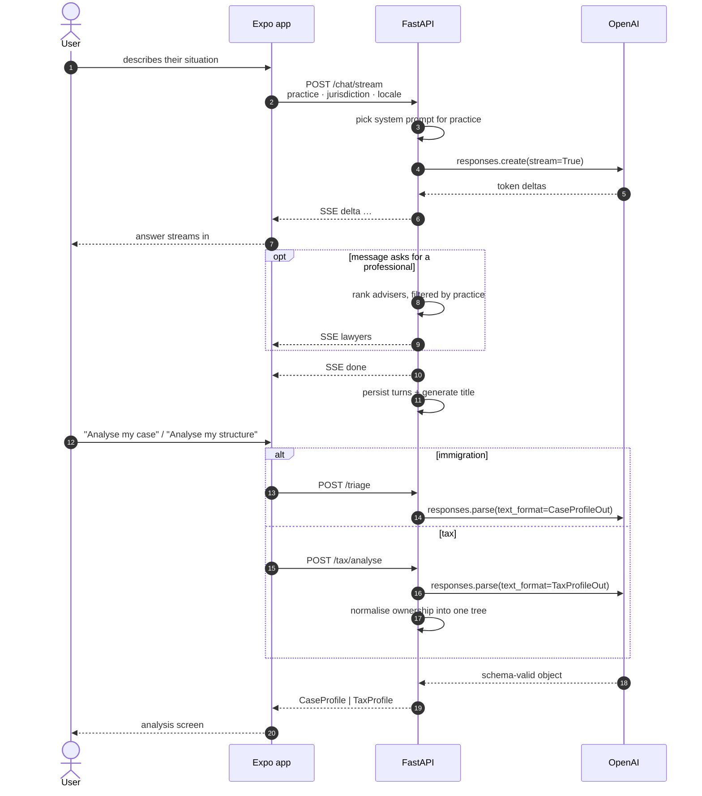

### The practice split

One `practice` field forks the prompt, the schema and the analysis screen — then everything
rejoins at adviser matching.

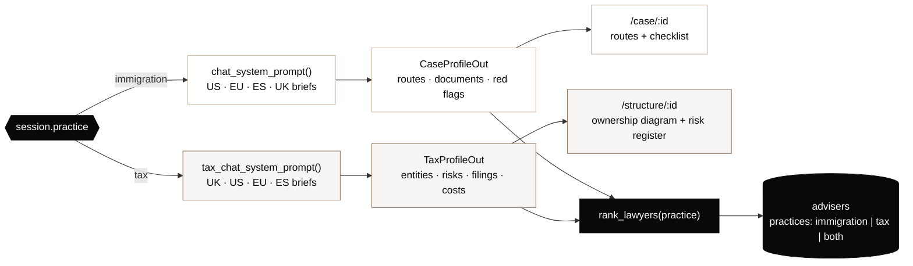

**Models** (OpenAI Responses API)

| Task | Model | Why |
|---|---|---|
| Chat | `gpt-5.6-terra` | `stream=True`, `reasoning.effort: low` — fast first token |
| Visa triage | `gpt-5.6-terra` | `responses.parse` with a Pydantic `text_format`, `effort: medium` |
| Structure analysis | `gpt-5.6-terra` | same, at `effort: high` — an entity group and its knock-on filings need more chained inference |
| Titles, moderation | `gpt-5.6-luna` | cheap, high-volume, `effort: none` |

All are configurable in `.env`.

### How the two practices share code

One `practice` field (`immigration` | `tax`) is carried on the chat session, the suggested
topics and the adviser records. It selects the system prompt and filters the directory;
everything else is shared.

| Shared | Separate per practice |
|---|---|
| Streaming chat, SSE plumbing | System prompt + jurisdiction briefs |
| Adviser matching algorithm | Structured-output schema |
| Card, profile, booking, WhatsApp/mailto | Analysis screen |
| Forum, admin, auth, i18n | Specialty vocabulary |

Matching filters by practice **before** scoring, so an immigration lawyer can never surface for
a transfer-pricing question however well they score on jurisdiction and language.

---

## Setup

**Prerequisites:** Python 3.12+, Node 20.19+, and an OpenAI API key.
Xcode is only needed for the iOS simulator.

### 1. Backend

```bash
cd backend
python3 -m venv .venv
.venv/bin/pip install -r requirements.txt

cp .env.example .env
#  →  open .env and set OPENAI_API_KEY

.venv/bin/python -m app.seed          # 44 advisers, topics, forum, admin user
.venv/bin/python -m app.demo_data     # optional: one worked analysis per practice
.venv/bin/uvicorn app.main:app --host 0.0.0.0 --port 8000 --reload
```

API docs at http://localhost:8000/docs · health at `/api/health`.

The server boots without a key — the non-AI half stays usable and AI routes return a clear
503 instead of crashing. `app.demo_data` is optional: it writes one hand-authored analysis per
practice (the F-1 case and the UK/US group above) so the case and structure screens can be
explored before you have a key. It is demonstration content, not model output.

### 2. Mobile app

```bash
cd mobile
npm install
npx expo start            # then press  w  for web,  i  for iOS,  a  for Android
```

- **Web** → http://localhost:8081
- **iOS Simulator** → `npx expo start --ios` (installs Expo Go automatically)
- **Real phone** → `npx expo start --tunnel` and scan the QR code with Expo Go

The API base URL is inferred automatically: `localhost` on web, and the LAN host Metro is
served from on a device. Override it with `EXPO_PUBLIC_API_URL` when you deploy.

> Because a device resolves the backend over the LAN, start uvicorn with
> `--host 0.0.0.0` (as above) rather than the default loopback binding.

**If port 8000 is already taken** (another project on this machine currently uses it), run the
backend elsewhere and point the app at it:

```bash
.venv/bin/uvicorn app.main:app --host 0.0.0.0 --port 8001 --reload
echo 'EXPO_PUBLIC_API_URL=http://localhost:8001' > ../mobile/.env
echo 'VITE_API_URL=http://localhost:8001/api'    > ../admin/.env
```

Restart Metro afterwards — `EXPO_PUBLIC_*` variables are inlined at bundle time. Deleting
`mobile/.env` restores the default resolution in `src/api/config.ts`.

### 3. Admin portal

```bash
cd admin
npm install
npm run dev               # http://localhost:5173
```

### Demo accounts

| Role | Email | Password |
|---|---|---|
| Client | `mike@example.com` | `demo12345` |
| Admin | `admin@ailawyer.app` | `admin12345` |

Both are created by the seed script and configurable in `.env`.

---

## Testing

```bash
cd backend
.venv/bin/python -m pytest            # 52 tests: matching, practice isolation, auth,
                                      # forum permissions, schemas, ownership repair
```

Schema note: `create_all()` adds new tables but not new columns. If you are upgrading a
database created before the tax feature, rebuild it — the seed is idempotent and the data is
demo content:

```bash
rm backend/ailawyer.db && .venv/bin/python -m app.seed
```

```bash
cd mobile && npx tsc --noEmit         # typecheck
cd admin  && npm run build            # typecheck + production build
```

---

## Design

Tokens are extracted from the reference shot and live in `mobile/src/theme/tokens.ts` — the
single source of truth, mirrored as CSS variables in `admin/src/styles.css`.

| Token | Hex | Use |
|---|---|---|
| `canvas` | `#EFEFEE` | app background |
| `surface` | `#FFFFFF` | cards, bubbles, composer |
| `ink` | `#0A0808` | primary text, black pill CTAs |
| `inkMuted` | `#605954` | secondary text |
| `subtle` | `#937E6D` | tertiary text, placeholders |
| `tan` | `#CBB9A8` | warm accent, active chips |
| `taupe` | `#4B3E34` | deep accent |
| `border` | `#E3E4E4` | hairlines |

Type is **Plus Jakarta Sans**. Radii: pills `999`, cards `24`, sheets `32`, composer `28`.
One soft shadow everywhere — `rgba(10,8,8,0.06)`, blur 24, y-offset 8.

### Replacing the hero art

The splash uses an original scales-of-justice mark
(`mobile/src/components/JusticeHero.tsx`) drawn in the same palette — the shot's marble Lady
Justice render is the designer's own asset and is not redistributed here. To use a photograph
instead, drop one at `mobile/assets/images/justice.png` and swap the `<JusticeHero />` element
in `mobile/src/app/index.tsx` for an `<Image>`.

---

## Notes & limitations

- **Voice input** uses the browser Web Speech API, so the "Speak" control is live on the web
  build and renders disabled on native. On-device speech needs `expo-speech-recognition` and a
  custom dev build.
- **SQLite** suits a single-worker deployment. The chat rate limiter is in-process for the same
  reason — move both to Postgres/Redis before running multiple workers.
- **Adviser data is seeded demo content.** Names, avatars, rates and contact details are
  fictional placeholders and must be replaced before any real use.
- **This app does not give legal or tax advice.** It provides general information, shows a
  disclaimer before first use, and marks every AI surface accordingly ("AI guidance, not legal
  advice" / "not tax advice").
- **Tax guardrails are deliberately strict.** Tax questions invite specific numbers, and a
  confidently wrong rate is worse than an honest range — so the prompt forbids quoting rates,
  thresholds or filing fees it is not sure of, refuses structures whose main purpose is
  avoidance, flags when a structure would need genuine commercial substance, and names the
  treaty or statute for a qualified adviser to confirm. All of it lives in
  `backend/app/services/prompts.py` so it is auditable in one place.
